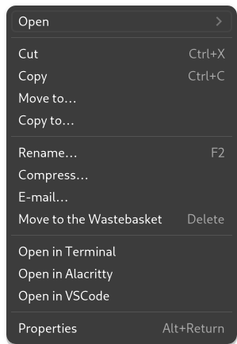

# Nautilus Extensions

With Gnome 43 update, the [filemanager-actions](https://gitlab.gnome.org/Archive/filemanager-actions) does not work anymore. After a little research, I switched to  [nautilus-python](https://gitlab.gnome.org/GNOME/nautilus-python/) and added my own "extensions" to enable my own "Open in" actions in nautilus.

Thanks to the [examples](https://gitlab.gnome.org/GNOME/nautilus-python/-/tree/master/examples) it was easy to create new actions for the context menu.



* [alacritty.py](alacritty.py) allows to open the selected folder in alacritty (*because I don't use gnome-terminal*)
* [code.py](code.py) allows to open the selected folder with vs code

## Installation

You need to install the **nautilus-python** package on your system.

The simple create `~/.local/share/nautilus-python/extensions` and save the python files there.

#### Arch Linux

```console
$ sudo pacman -S python-nautilus
```

